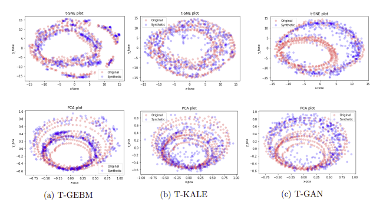

# Time-GEBM

## Introduction

This repository contains the work for my MSc Computational Statistics and Machine Learning thesis at UCL. In this project I develop two [**Generalized Energy Based Models**](https://arxiv.org/abs/2003.05033) for time-series generation. The first extends the attention-based GAN [**TTS-GAN**](https://arxiv.org/abs/2202.02691) and the second the recurrent-based GAN [**C-RNN-GAN**](https://arxiv.org/abs/1611.09904). The report can be found in the report.pdf file. 

t-SNE results for the attention-based GEBM on chickenpox dataset.



## References

Alot of the code/work in this repo is from the Pytorch implementation of the original paper on GEBM, which can be found [**here**](https://github.com/MichaelArbel/GeneralizedEBM). Similarly the code for TTS-GAN can be found here and for C-RNN-GAN here. In the source material credit has been given when external code has been utilised.


## Requirements

```
python==3.6.2 or newer
torch==1.4.0 or newer
torchvision==0.5.0 or newer
numpy==1.17.2  or newer
```

All dependencies can be installed using:

```
pip install -r requirements.txt
```


## How to use


### Training

To train run the below; 

```
python main.py --config=configs/training.yaml --dataset_type=%dataset_name% --features=%features% --Z_dim=%Z_dim% --generator=%generator% --discriminator=%discriminator%
```

Please ensure %dataset_name% in ['Stock','Energy','Chickenpox']. Depending on the %dataset_name% the %features% will then be either [5,28,20]. If training the attention-based network then %Z_dim% = 100 and %generator%, %discriminator% = 'tts'. If training the recurrant-based network then %Z_dim% = [32,20] and %generator%, %discriminator% = 'crnn'.

### Sampling

```
python main.py --config=configs/sampling.yaml --dataset_type=%dataset_name% --features=%features% --Z_dim=%Z_dim% --generator=%generator% --discriminator=%discriminator% --latent_sampler=langevin --lmc_gamma=0.0001


